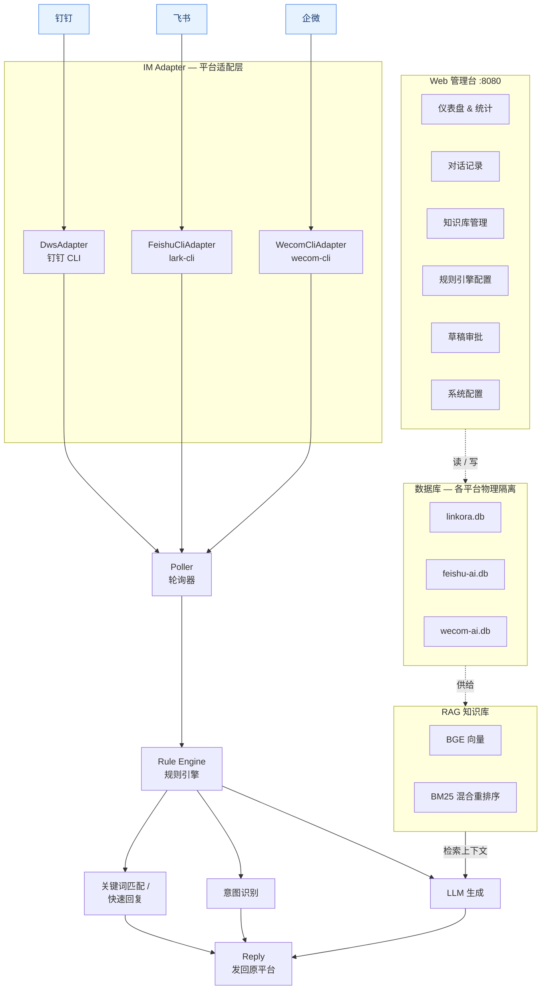

<div align="center">

# 灵桥 · Linkora

**多平台 AI 智能连接中枢**

统一接入钉钉 / 飞书 / 企业微信，融合 RAG 知识库、规则引擎、LLM 对话与 Web 管理台
—— 连接企业智能，桥接无限可能。


<br>

[快速开始](#快速开始) · [核心能力](#核心能力) · [配置](#配置速查) · [项目结构](#项目结构) · [贡献指南](#贡献指南) · [文档索引](#文档索引)
· [安全政策](SECURITY.md) · [贡献指南](CONTRIBUTING.md) · [行为准则](CODE_OF_CONDUCT.md)

</div>

---

## 项目简介

**灵桥（Linkora）** 把企业级 AI 助手挂到团队日常 IM（钉钉 / 飞书 / 企业微信）上：让一个「能读懂企业知识、会调用工具、可被人工审核」的 AI 分身，直接出现在你已经在用的群聊和单聊里。

典型链路：消息进来 → 规则 / 意图分流 → 命中知识库或调用工具 → LLM 生成回复 → 原路发回；全过程在 Web 管理台可查、可调、可审批。三套平台各自独立适配、独立数据库、独立轮询器，数据物理隔离，可按平台独立启停。

| 维度 | 规模（当前代码实测） |
| --- | --- |
| 接入平台 | **3 个**（钉钉 / 飞书 / 企业微信，数据物理隔离） |
| 内置工具 | **38 个**（Tool Calling，单一真源 `BUILTIN_TOOL_MANIFEST`） |
| 意图分类 | **39 个**（9 处置 + 7 动作 + 23 领域） |
| Web 管理台 | **15 个页面（SPA）** / 29 个路由模块 / 153 端点 |
| 代码规模 | ~170 个 `src` Python 模块 / 200+ 测试文件 |

---

## 架构总览




分层细节与处理时序见 [架构设计](docs/architecture.md)。

---

## 核心能力


### 多平台接入
钉钉 / 飞书 / 企微各自独立适配器、独立数据库、独立轮询器，可按平台独立启停；物理隔离到不同 SQLite 库。自动区分单聊 / 群聊 / 系统推送，消息编辑 / 撤回实时同步，同一发送者短时间多条消息防抖合并。Web 与后台轮询器（worker）进程分离，改 Web 代码只重启 web 进程不打断 ingestion。

### RAG 知识库
入库格式覆盖 PDF / Word / PPT / 图片 OCR / Markdown / URL / 钉钉文档 / 飞书文档 / 维基空间；BGE 中文模型本地离线推理，混合重排序（向量 0.6 + BM25 0.4）；标题行与正文粘连分块；低于置信度阈值不强行作答，转草稿 / 转人工。

### 规则引擎与意图
高频场景关键词精确匹配、毫秒级响应、不走 LLM；39 个内置意图覆盖天气 / 联网搜索 / 日程 / 待办 / 审批 / 考勤 / 组织 / 配置 / 维基等；黑白名单按会话 / 用户 / 关键词多维度控制；每条消息的意图判定与路由决策可追溯。

### Tool Calling（38 个内置工具）
由 `BUILTIN_TOOL_MANIFEST` 单一真源声明并自动注册，按意图关键词自动匹配，覆盖消息通讯、知识文档、组织人员、日程待办、审批（钉钉 10 个）、考勤、会议纪要、长期记忆、运维工具等。

### Web 管理台（`:8080`）
仪表盘统计、对话记录检索、知识库管理、规则引擎配置、草稿审批、在线编辑 `config.yaml`、日志 / 健康检查 / 决策追踪 / 成本质量看板。

### 智能增强
跨会话长期记忆（按用户隔离、自动压缩归档）、图片 OCR 让 LLM 看懂截图、长对话后台异步摘要压缩、从主人历史消息抽取语气人格、RAG 门控减少 token 浪费、收信探针告警、定时同步 / 备份 / 清理。

---

## 快速开始

### 本地运行

```bash
# 1. 克隆并安装依赖
git clone <repo-url> linkora && cd linkora
python3 -m venv .venv && source .venv/bin/activate
pip install -r requirements.txt

# 2. 准备配置
cp config.yaml.example config.yaml
#    至少填写：llm.api_key / llm.base_url，platforms[].adapter.cli_path

# 3. 平台 CLI 登录（以钉钉为例）
dws auth login
#    飞书：lark-cli login   企业微信：wecom-cli login

# 4. 启动（双进程：web + worker）
.venv/bin/python scripts/run_linkora.py
#    Web 管理台 → http://localhost:8080
```

后台常驻：`nohup .venv/bin/python scripts/run_linkora.py > logs/$(date +%Y%m%d).log 2>&1 &`

更多启动形态（指定端口、`--no-worker` / `--worker-only` / `--dev` 等）见 `scripts/run_linkora.py --help`。

### Docker 部署

```bash
docker compose up -d
```

部署细节见 [部署指南](docs/deployment.md) 与 [进阶部署](docs/DEPLOY.md)。

---

## 配置速查

`config.yaml` 为 YAML 格式，Web 管理台同步读写，保存即生效。顶层配置段：

```
platforms   多平台主配置（适配器 / 存储 / 轮询器）★
llm         LLM 接入与高级策略        embedding   向量模型
rag         检索策略                  memory      长期记忆
rules       黑白名单 / 关键词 / 意图   tools       工具开关与速率限制
skills      技能系统                  skillhub    技能市场
web         管理台与鉴权              storage     默认存储
logging     日志                      safety      安全护栏
llm_throttle 限流                     dead_letter 死信队列
dws         钉钉 CLI 全局设置
```

### 平台配置（`platforms`）★ 运行期真源

```yaml
platforms:
  - id: dingtalk
    display_name: 钉钉
    enabled: true
    adapter_type: dingtalk
    storage:
      type: sqlite
      path: ./data/linkora.db
      backup_enabled: true
      backup_dir: ./data/backups
      backup_interval_hours: 24
    poller:
      interval_seconds: 10
      history_days: 3
      max_concurrent_replies: 4
      skip_msg_types: [system, app]
    adapter:
      cli_path: /path/to/cli
      timeout: 30

  - id: feishu
    enabled: true
    adapter_type: feishu
    storage: { path: ./data/feishu-ai.db }
    adapter: { cli_path: lark-cli }

  - id: wecom
    enabled: false
    adapter_type: wecom
    storage: { path: ./data/wecom-ai.db }
    adapter: { cli_path: wecom-cli }
```

> 轮询配置真源在 `platforms[].poller`（按平台隔离），**不存在根级 `poller:` 段**。

全部配置项与 `llm` / `embedding` 段示例见 [配置参考](docs/configuration.md)。

---

## 项目结构

```
linkora/
├── main.py                 # 兼容门面；真实入口在 src/platform/lifecycle.py
├── scripts/run_linkora.py  # 多进程启动器：web(:8080) + worker
├── config.yaml(.example)   # 核心配置 / 完整示例
├── src/                    # ~170 个 Python 模块
│   ├── platform/           #   运行时层：启动、生命周期、消息循环
│   ├── im_adapter/         #   多平台适配层（CLI 执行 + 适配器）
│   ├── dws_adapter/        #   钉钉 CLI 适配器包（chat/media/oa/wiki…）
│   ├── llm/                #   LLM 编排：agent / client / router / RAG
│   ├── memory/             #   存储检索：SQLite + BGE 向量 + FAISS
│   ├── tools/              #   38 个内置工具（registry 单一真源）
│   ├── skills/             #   技能系统：发现 / 加载 / 路由
│   ├── intent/             #   意图分类注册表（39 意图 + 工具映射）
│   └── poller*.py          #   消息轮询器与核心子模块
├── web/                    # FastAPI 管理台（api.py / routers/ / static SPA）
├── docs/                   # 文档（见下方索引）
├── tests/                  # 200+ 测试文件
└── data/ · logs/ · docker/
```

---

## 开发与测试

```bash
# 一律使用项目内 .venv，不要直用系统 python
.venv/bin/python -m pytest tests/ -q

# macOS 上涉及 torch 的测试需绕过 OpenMP 重复注册
KMP_DUPLICATE_LIB_OK=TRUE .venv/bin/python -m pytest tests/ -q
```

环境要求、构建流程、贡献规范见 [开发指南](docs/DEV_GUIDE.md)。

---

## 贡献指南

以内部协作方式演进，欢迎按以下约定提交改动。

### 环境约定
- **一律使用项目内 `.venv`** 运行 / 调试 / 装包，避免「依赖装了却 ModuleNotFoundError」。
- 改完 `src/` 后需**重启 bot**（`scripts/run_linkora.py`）让修复生效；纯测试改动无需重启。
- 涉及 torch / faiss 的测试在 macOS 上加 `KMP_DUPLICATE_LIB_OK=TRUE`。

### 提交规范

采用中文 `type(scope)` 前缀：

| type | 含义 |
| --- | --- |
| `feat` | 新功能 |
| `fix` | 缺陷修复 |
| `refactor` | 重构（零行为变更） |
| `perf` | 性能优化 |
| `test` | 测试补充 / 对齐 |
| `docs` | 文档 |
| `chore` | 杂项 / 配置 |

新增 agent 工具**必须同步 5 处**（单一真源 `BUILTIN_TOOL_MANIFEST` → `config.py` → `config.yaml.example` → live `config.yaml` → `TOOL_ACTION_MAP`），详见 [开发指南](docs/DEV_GUIDE.md)。

---

---

## 文档索引

**上手与使用**

| 文档 | 说明 |
| --- | --- |
| [配置参考](docs/configuration.md) | `config.yaml` 全部配置项 |
| [部署指南](docs/deployment.md) | 本地运行、Docker、后台服务 |
| [进阶部署](docs/DEPLOY.md) | 平台前置条件、CI、systemd/launchd |
| [常见问题](docs/faq.md) | FAQ 与排障 |

**理解系统**

| 文档 | 说明 |
| --- | --- |
| [架构设计](docs/architecture.md) | 整体架构、分层、目录、处理流程 |
| [设计总览](docs/design.md) | 设计哲学、路由模式、决策追踪（系统结构见架构设计） |
| [RAG 知识库](docs/rag.md) | 格式支持、分块、检索与重排序 |
| [意图分类](docs/intent-model.md) | 意图体系、工具映射、决策追踪 |
| [工具清单](docs/tools.md) | 内置工具详情 |
| [Web API](docs/web-api.md) | 后端接口概览 |

**开发与演进**

| 文档 | 说明 |
| --- | --- |
| [开发指南](docs/DEV_GUIDE.md) | 环境、构建、测试、贡献 |
| [长期记忆](docs/memory.md) | 数据模型、写入与召回策略 |

---

## License

本项目基于 **GNU General Public License v3.0 (GPL-3.0)** 发布。

- 完整许可证文本见 [LICENSE](LICENSE)。
- 您可以自由地使用、修改和分发本项目的源代码；任何分发（含修改后版本）都必须以 GPL-3.0 开源，并保留原始版权声明与许可证。
- 本项目按"现状"（as-is）提供，不提供任何明示或暗示的担保。

使用过程中请遵守所在组织各办公平台（钉钉 / 飞书 / 企业微信）开放平台的相关规范与权限要求。
